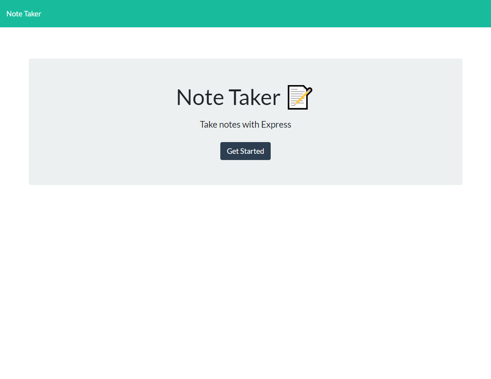

# Note_Taker

## Description
This Note Taker is a web application to create note you are able to access anywhere, on the go, at home, or while you shop! You are able to create new notes or delete the ones you don't need.

## Table of Contents
- [Access](#access)
- [Usage](#usage)
- [Features](#features)
- [Links](#links)
- [Credits](#credits)
- [License](#license)

## Access
To access this web application please click the [Deployed Application](https://note-taker-paw6063.herokuapp.com/notes) link.

## Usage
When you first arrive to the web application you will be displayed with the home page which you may get started with the 'Get Started' button.

Once you have gotten started you may view pre existing note or delete them. Or you may create a new note with the add button on the top right.

Once you create a new note you will have to save the note to the page with the save button on the top right.

## Features
- Node.js
- Express.js

## Links
- [GitHub Repository](https://github.com/PAW6063/Note_Taker)

- [Deployed Application](https://note-taker-paw6063.herokuapp.com/notes)

## License
